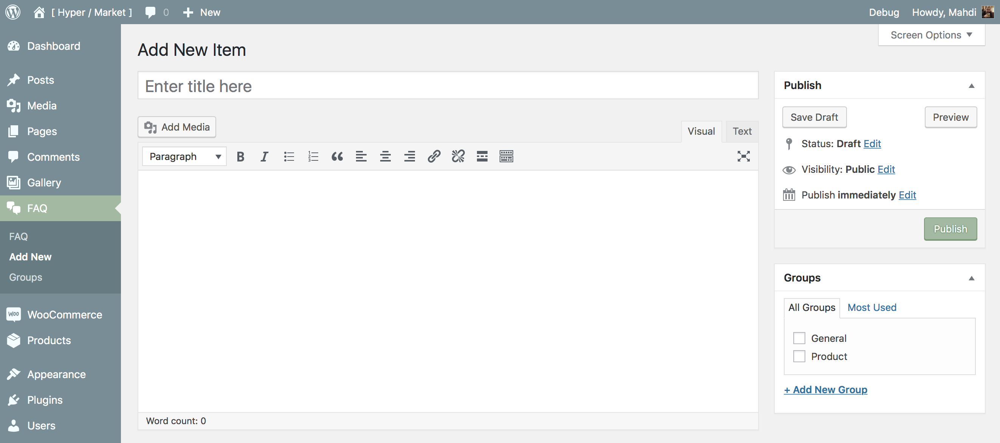

# Create FAQs

[Hypermarket Plus](https://www.mypreview.one) has inbuilt support for FAQ custom post type. Use this post type to easily create, order and publicize FAQs and display the questions in groups by tagging them, and even load them closed or readily open.

!> This feature is available only to **Hypermarket Plus** users! [Upgrade now](https://www.mypreview.one).

## Adding FAQs

Similar to posts in WordPress, you can **add, delete, and edit** your FAQ items here.

* Navigate to the **FAQ** tab.
* Click the **Add New** button in the top left-hand corner of the page.
* Add a **Title**. 
*This will appear as a FAQ’s question.*
* Enter a **description** or custom content. 
*This will appear as a FAQ’s answer.*
* As needed, select a **Group** for question.
* **Publish** or **Update** the item.
