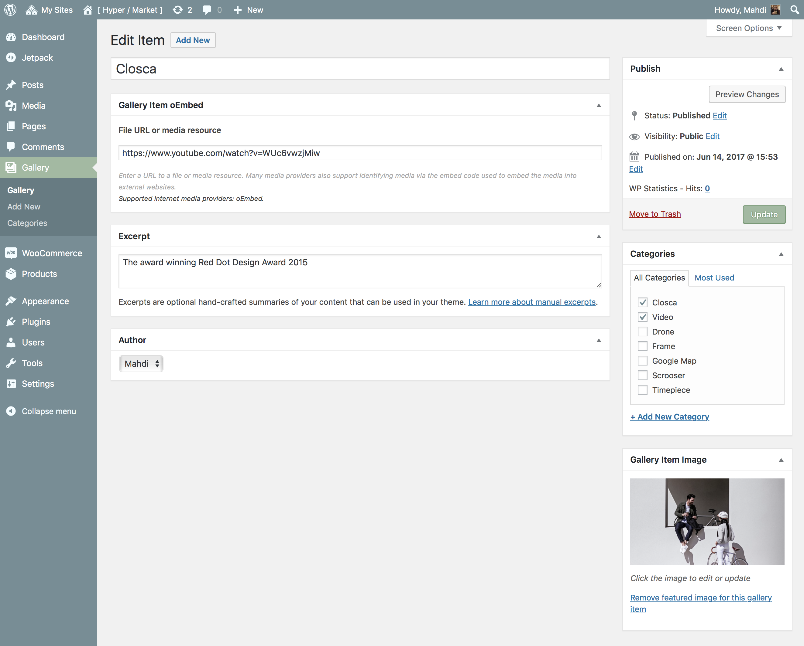
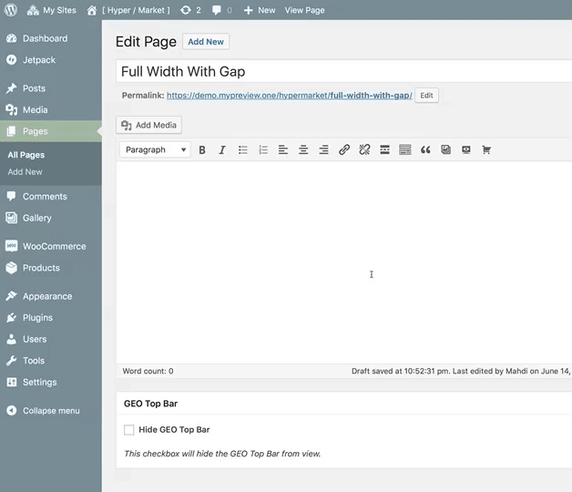

# Create galleries

[Hypermarket Plus](https://www.mypreview.one) has inbuilt support for gallery custom post type. Use this post type to create amazing galleries.

!> This feature is available only to **Hypermarket Plus** users! [Upgrade now](https://www.mypreview.one).

## Adding galleries

Similar to posts in WordPress, you can **add, delete, and edit** your gallery items here.



* Navigate to the **Gallery** tab.
* Click the **Add New** button in the top left-hand corner of the page.
* Add a **Title**.
* Optionally, enter a **URL** to a file or **media resource**.<br/>
*Supported internet media providers: oEmbed (e.g. Youtube, Vimeo, Google Maps etc)*
* Optionally, enter a **description** or **excerpt** about the item.
* As needed, select a **Category**.
* Upload a **Gallery Item Image**.
* **Publish** or **Update** the item.

## Shortcode

You can add the gallery component to any page using the ```[hypermarket-plus-gallery]``` shortcode. Also, it is possible to pass the following attributes to the shortcode to create custom hero elements.

```php
gap
col
filter
all_filter
order
orderby
size
limit
category_ids
pagination
```

A full shortcode could look like:

```php
[hypermarket-plus-gallery gap="true" col="3" filter="true" all_filter="true" order="DESC" orderby="none" size="full" limit="9" category_ids="" pagination="ajax"]
```



Alternatively, locate an additional button in TinyMCE’s toolbar – place the cursor where the gallery tooltip will appear, then click the **gallery button**.

After clicking the interface button, a modal dialog with a few options to config will appear, optionally fill the blanks and hit the **OK** button to generate a new gallery shortcode.
