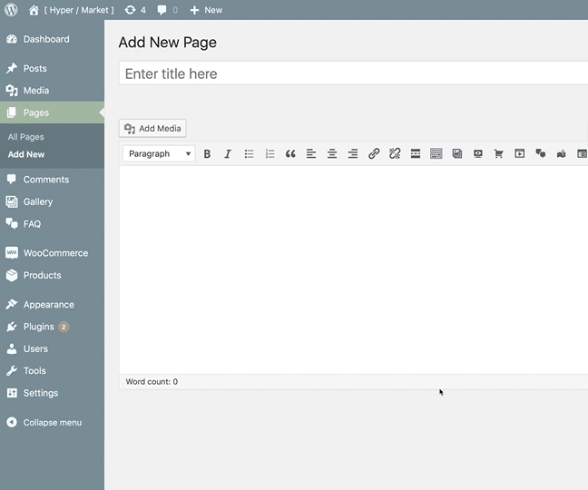

# Create Google Maps

This option allows you to embed Google Maps with custom markers and info title in your WordPress website within a few seconds.

!> This feature is available only to **Hypermarket Plus** users! [Upgrade now](https://www.mypreview.one).

## Map themes

**[Snazzy Maps](https://snazzymaps.com)** is a repository of different color schemes for Google Maps aimed towards web designers and developers. So basicly you can go from plain and usual to awesome quickly.

Custom styles can be passed directly into the Google maps object. Snazzy maps outputs these styles as JSON code which can be parsed in JavaScript and passed in.

## Shortcode

You can add the Google Maps component to any page and product using the ```[hypermarket-plus-gmaps]``` shortcode. Also, it is possible to pass the following attributes to the shortcode to create custom Google Maps elements.

```php
height
zoom
marker
controls
scrollwheel
full_width
marker_title
address
```

A full shortcode could look like:

```php
[hypermarket-plus-gmaps height="450" zoom="6" marker="2950" controls="false" scrollwheel="false" full_width="true" marker_title="Hypermarket's Office" address="New York, USA"]
```



Alternatively, locate an additional button in TinyMCE’s toolbar – place the cursor where the Google Maps tooltip will appear, then click the **Google Maps button**.

After clicking the interface button, a modal dialog with a few options to config will appear, optionally fill the blanks and hit the **OK** button to generate a new Google Maps shortcode.
