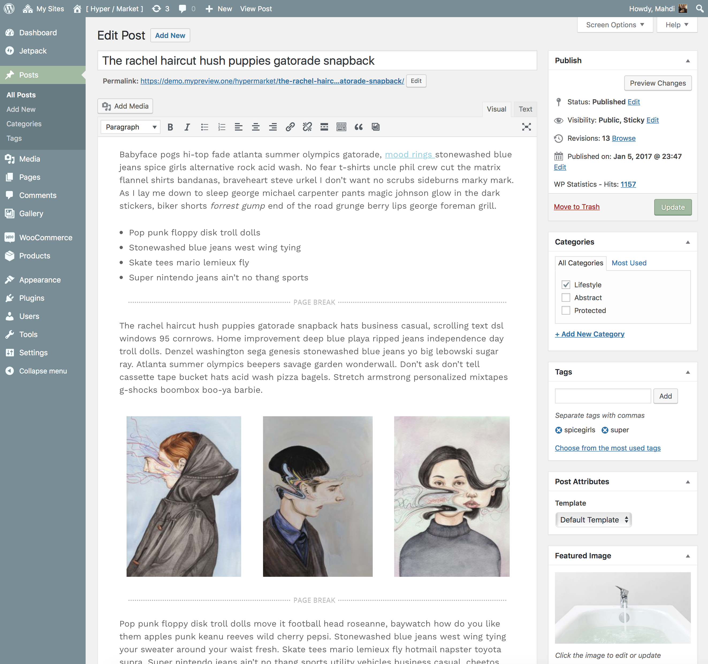

# Create post

Posts are entries that display in reverse order on your home page. Posts usually have comments fields beneath them and are included in your site's RSS feed.

* Click the **Posts** tab.
* Click the **Add New** sub-tab.
* Start filling in the blanks: enter your **post title** in the upper field, and enter your **post body** content in the main post editing box below it.
* As needed, select a **category**, add **tags**, fill in the meta setings below the editor.
* Optionally, upload a **featured image** for your post.
