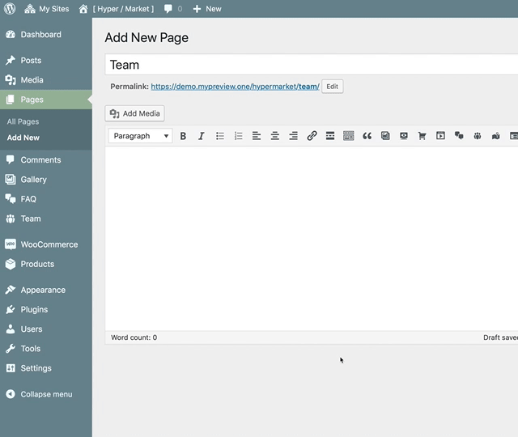

# Create team members

[Hypermarket Plus](https://www.mypreview.one) has inbuilt support for team members custom post type. Use this post type to easily create, team profile management system for [Hypermarket theme](http://demo.mypreview.one/hypermarket/about). Load in your team members and display their profiles via a shortcode.

!> This feature is available only to **Hypermarket Plus** users! [Upgrade now](https://www.mypreview.one).

## Adding team members

Similar to posts in WordPress, you can **add, delete, and edit** your team members here.


* Navigate to the **Team** tab.
* Click the **Add New** button in the top left-hand corner of the page.
* Add a team members name in the **title** field.
* Upload an image via the **Featured Image** metabox.
* Add a **role** in the team member details panel.
* Optionally, input users social media website profile URLs.
* **Publish** or **Update** the item.

### Supports the following social media sites

* Behance
* DeviantArt
* Digg
* Dribbble
* Facebook
* Flickr
* Foursquare
* Github
* Google+
* Instagram
* Last.fm
* LinkedIn
* PayPal
* Pinterest
* Reddit
* Skype
* SoundCloud
* Stack Overflow
* Steam
* StumbleUpon
* Tumblr
* Twitch
* Twitter
* Vine
* Vkontakte
* WordPress
* Xing
* Yahoo!
* Yelp
* YouTube

## Shortcode

You can add the team members component to any page using the ```[hypermarket-plus-team]``` shortcode. Also, it is possible to pass the following attributes to the shortcode to create custom team members elements.

```php
col
order
orderby
limit
```

A full shortcode could look like:

```php
[hypermarket-plus-team col="4" order="DESC" orderby="none" limit="4"]
```



Alternatively, locate an additional button in TinyMCE’s toolbar – place the cursor where the team members tooltip will appear, then click the **Team button**.

After clicking the interface button, a modal dialog with a few options to config will appear, optionally fill the blanks and hit the **OK** button to generate a new team members shortcode.
