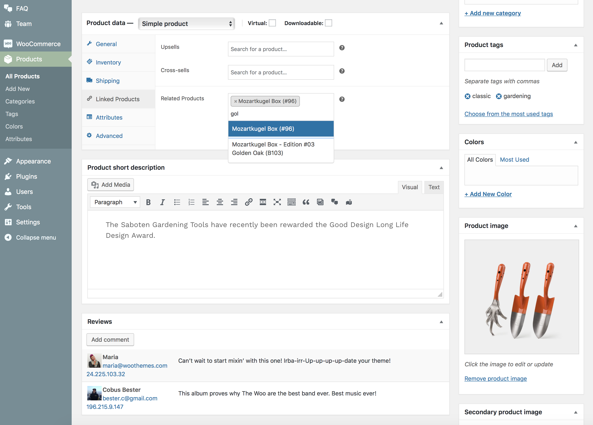

# Custom related products

This option allows you to choose which products should show in the related products section instead of pulling them in by category or tag on single-product view.

!> This feature is available only to **Hypermarket Plus** users! [Upgrade now](https://www.mypreview.one).

* Click the **Products** tab.
* Edit the **product** that you want to show custom related products in.
* On the edit product page, scroll down until you locate the **Product Data** meta box in the bottom left-hand of the page.
* Under **Linked Products** you will now have a **Related Products** selector alongside the **Cross-Sells** and **Upsells**.
* Start by typing 3 or more character into search field and list of available and published products will appear
* Select any custom product from dropdown list.
* **Update** or **Publish** the product post.
