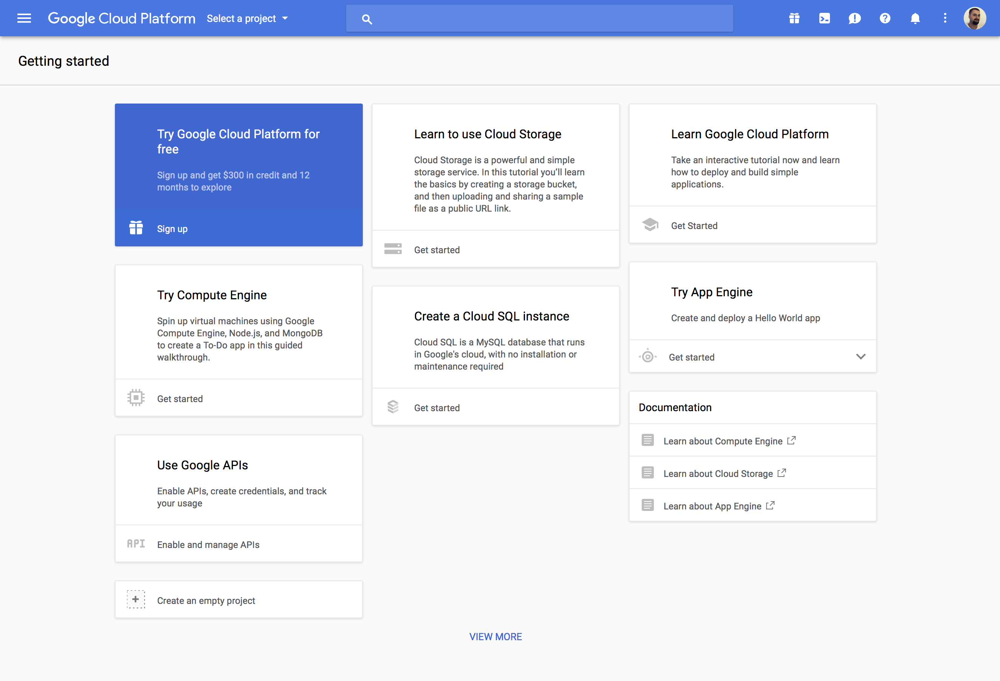

# Generate a Google Maps API key

As **from 22 June 2016**, all calls to the Google Maps **requires an API key**.

!> Note that this does not necessarily mean that you will have to pay more as you are still allowed up to **25000 map requests per day** for free. If your shop requires more than 25000 requests per day, you will be responsible for extra charges. However, for 90% of website owners, this will not be needed.

To obtain a Google Maps JavaScript API Key, follow the instructions below:



* First, You’ll need to sign in with a **Google account** if you’re not already logged in.
* Go to the [Google Cloud Platform Console](https://console.cloud.google.com/start) page.
* Click the link to the Google Maps Javascript API in the listing under Google Maps APIs.
* Then click the Use Google APIs panel.
* You’ll be prompted to **choose a name** for a new project and to accept the API agreement.
* On the page that appears after the project has saved you will need to enable **three Google Maps API options**.<br/> 
*Enable on **Google Maps Javascript API**, **Google Places API Web Service** and **Google Maps Geocoding API**.*
* After the all the APIs are activated, click **Go to Credentials**.
* On the credentials screen, make sure that Google Maps Javascript API is selected under **Which API are you using?**
* Now set the **Where will you be calling the API from?** dropdown to say Web browser (Javascript) and click **What credentials do I need?**
* On the next screen **enter a name** for the API key.
* You’ll also need to **add the domain name** of the site whereever you’re using [Hypermarket Plus](https://www.mypreview.one) plugin.
* We recommend adding more than one entry using the following patterns:
```js
*.yourdomain.com
yourdomain.com
```

!> To avoid problems with **www** and **non-www** versions of your domain, don’t include the **www** part of your website URL.

* After clicking the Create API Key button, you’ll be shown your new API key.
* Copy the key shown in the screen/field.
* Go to **Settings** » **[H/M] Plus Settings**.
* Click the **Google Maps** tab.
* Enter or paste the newly generated key into the **API Key field**.
* Then **Save Changes**.
