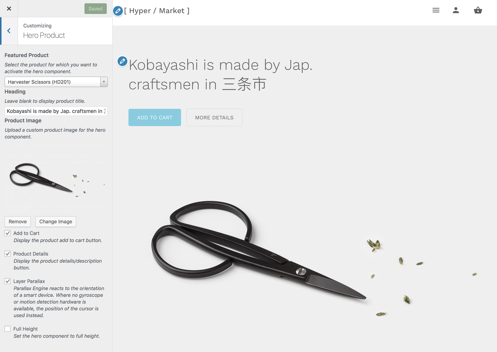
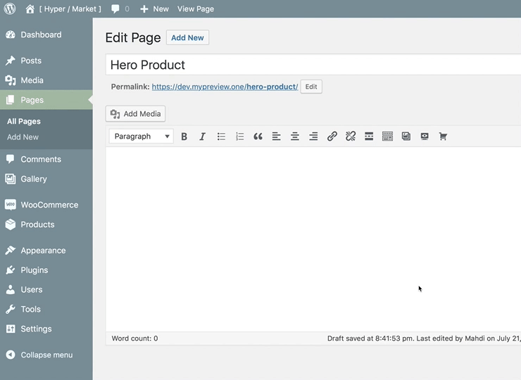

# Hero product

This option allows you to add a hero component to the homepage template, or on any page via shortcode. You can upload a background image (and set it to layer parallax effect) and tweak other appearance settings.

!> This feature is available only to **Hypermarket Plus** users! [Upgrade now](https://www.mypreview.one).

Product hero section can be adjusted with a few clicks via the WordPress **customizer**. Log into your website and then:



* Navigate to **Products**.
* Select the **star** in the featured column.<br/>
*Alternatively, select **Quick Edit** and then the **Featured** option.*
* **Update** the product to save the changes.
* On the frontend, in the Admin bar, click **Site Name** » **Customize**.
* On the backend, click **Appearance** » **Customize**.
* Navigate to **Hero Product** section.
* Locate the **Featured Product** option.
* Select the product for which you want to activate the hero component.
* Specify the text to be displayed in the hero component header.<br/>
*You can leave this field blank to display the product title.*
* Upload a **background image** for the hero component.
* Toggle the display of the product **add to cart** button.
* Toggle the display of the product **details/description** button.
* Toggle the **parallax effect** applied to the background image.<br/>
*Parallax Engine reacts to the orientation of a smart device. Where no gyroscope or motion detection hardware is available, the position of the cursor is used instead.*
* Optionally, check the **Full Height** checkbox, when enabled the product hero will intelligently resize the fill the browser window on page load.
* **Save & Publish**.

## Shortcode

You can add the product hero component to any page using the ```[hypermarket-plus-hero-product]``` shortcode. Also, it is possible to pass the following attributes to the shortcode to create custom hero elements.

```php
product_id
product_heading
product_image_id
add_to_cart_btn
details_btn
layer_parallax
full_height
full_width
```

A full shortcode could look like:

```php
[hypermarket-plus-hero-product product_id="87" product_heading="Name of the product goes here" product_image_id="2507" add_to_cart_btn="true" details_btn="true" layer_parallax="true" full_height="false" full_width="true"]
```


Alternatively, locate an additional button in TinyMCE’s toolbar – place the cursor where the hero product tooltip will appear, then click the **hero product button**.

After clicking the interface button, a modal dialog with a few options to config will appear, optionally fill the blanks and hit the **OK** button to generate a new hero product shortcode.
