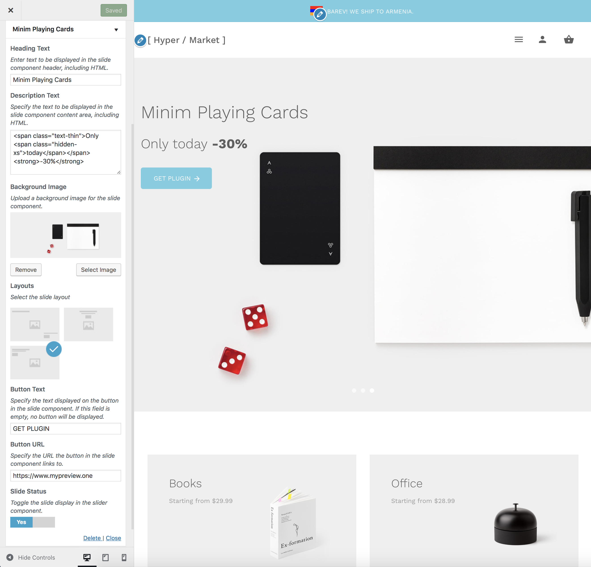
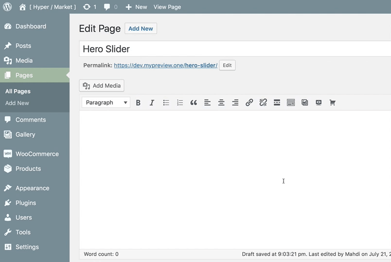

# Hero slider

This option allows you to create a high-quality image and **content hero slider** which supports touch navigation with a simple **swipe gesture**, Truly responsive and device friendly.

!> This feature is available only to **Hypermarket Plus** users! [Upgrade now](https://www.mypreview.one).

Hero slider section can be adjusted with a few clicks via the WordPress **customizer**. Log into your website and then:




!> You can toggle the visibility and reorder the hero slider component position using the [homepage control](homepage control) section.

?> If there are no components displaying in the WordPress customizer for **Hero Slider** you may not yet have the default Hypermarket homepage template configured and [set as the front page](setup-homepage-template) of your WordPress site as the **Hero Slider** customizer settings will only display if you have this page template set as the front page of your site. 

## Shortcode

You can add the hero slider component to any page using the ```[hypermarket-plus-hero-slider]``` shortcode.



Alternatively, locate an additional button in TinyMCE’s toolbar – place the cursor where the hero slider tooltip will appear, then click the **hero slider button**.
