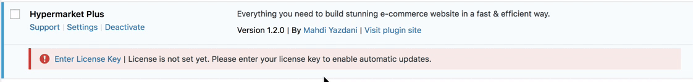

# Install and activate Hypermarket Plus plugin

!> Take a moment to review the [minimum requirements](https://mahdiyazdani.github.io/Hypermarket/#/minimum-requirements) before installation or you may encounter issues when using the plugin. 

?> Note that paid WordPress plugins (e.g. Hypermarket Plus) are not listed in the WordPress plugin directory. These plugins cannot be installed using the official wordpress repository and that’s why WordPress has the Upload method to install such plugins.

!> Whenever you are downloading the plugin files from your purchase receipt, you will get an archive file within **.zip** extension. After downloading the files you will be able to find **hypermarket-plus.zip** on your local machine, in case you are seeing the folder without zip extension it means your browser automatically unzipped the downloaded file while downloading, you need to zip it again to be able to upload on WordPress.

## WordPress admin panel

*(Recommended)*

* Visit **Plugins** » **Add New** page.
* Click on the **Upload Plugin** button on top of the page.
* This will bring you to the plugin upload page.
* Click on the **Choose file** button and select the plugin file you downloaded earlier to your computer.
* After you have selected the file, you need to click on the **install** now button.
* WordPress will now upload the plugin file from your computer and install it for you. You will see a success message after installation is finished.
* Once installed, you need to click on the **Activate Plugin** button to start using the plugin.
* To get started, visit the **Customizer** or plugin **Settings** page.

<hr/>

## Manually - FTP method

* Download the latest version of Hypermarket Plus plugin from your purchase receipt.
* Upload the extracted folder of **hypermarket-plus.zip** to the ```/wp-content/plugins/``` dir on your server via FTP.
* visit the WordPress admin area and click on the **Plugins** link in the admin menu.. 
* click on the **Activate** link below the plugin. Upon activating, you may need to configure the plugin settings.

## Activation instruction

To enable receiving automatic and one-click updates, locate the Hypermarket Plus plugin on plugins table page, then click **Enter License Key** and then enter your key (located in your purchase receipt) into the text field.



?> Once your license key is activated, whenever a new update is released you will be notified in WordPress Plugins page about it.

## Transfer license key

If you wish to transfer your license key to another domain name, be sure to **revoke** the registered key before deleting or uninstalling the plugin, or else you may need to purchase a new license key from [mypreview.one](https://www.mypreview.one) online store.

## Multisite or developers license

Note that MyPreview, LLC does **NOT** offer multisite or developers license at the moment. In case you want to use Hypermarket Plus on several sites be sure to [purchase](https://www.mypreview.one) one license per each site.
