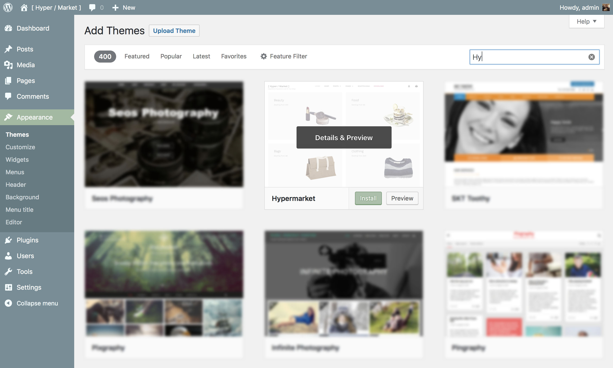

# Install and activate Hypermarket theme

!> Take a moment to review the [minimum requirements](https://mahdiyazdani.github.io/Hypermarket/#/minimum-requirements) before installation or you may encounter issues when using the theme. 

If you’re looking to install the [Hypermarket](https://wordpress.org/themes/hypermarket/) WordPress theme from the [wordpress.org themes directory](https://wordpress.org/themes/), then the easiest way is by using the WordPress admin theme search functionality.

[](https://vimeo.com/238212109 "Install and activate Hypermarket theme - Click to Watch!")



## Official directory 

*(Recommended)*

* Go to **Appearance** » **Themes**.
* Once you are on the themes page, click on the **Add New** button at the top.
* A search field will appear at the top right side of the page.
* Type **"Hypermarket"** into the field.
* When you see the Hypermarket theme, simply bring your mouse on top of the screenshot image. This will reveal the **install** button, preview button, and details button. Go ahead and click on the **install** button.
* WordPress will now install the Hypermarket theme and show you a success message along with the link to activate or live preview.
* Click on the **activate** button, and you’ve successfully installed and activated the Hypermarket WordPress theme.

<hr/>

## WordPress admin panel

* Download the latest version of Hypermarket from [wordpress.org themes directory](https://wordpress.org/themes/).
* Go to **Appearance** » **Themes**. 
* Click **Add New** tab, located at the top of the screen.
* Click **Upload Theme**.
* Choose **hypermarket.zip** from your local computer or machine and hit **Install Now** button.
* Activate Hypermarket by clicking on the **activate** button.

<hr/>

## Manually - FTP method

* Download the latest version of Hypermarket from [wordpress.org themes directory](https://wordpress.org/themes/).
* Upload the extracted folder of **hypermarket.zip** to the ```/wp-content/themes/``` dir on your server via FTP.
* Go to **Appearance** » **Themes**. 
* Activate Hypermarket by clicking on the **activate** button.
