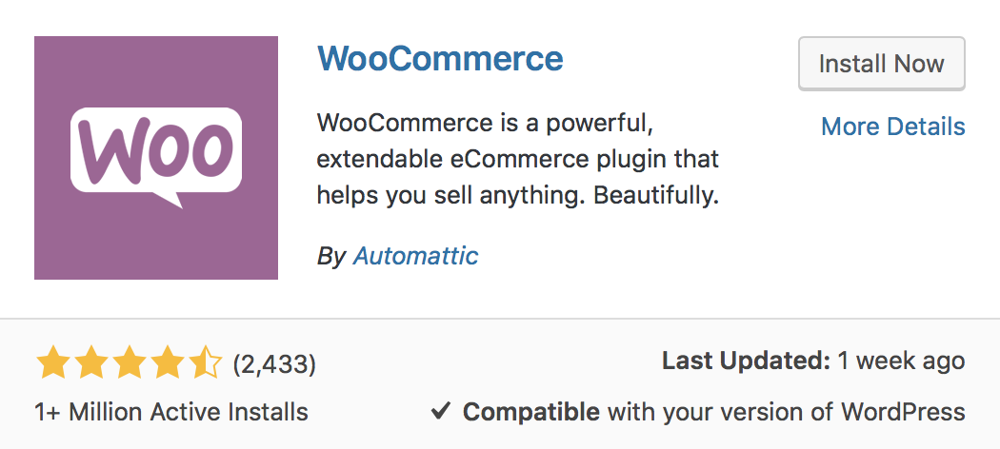
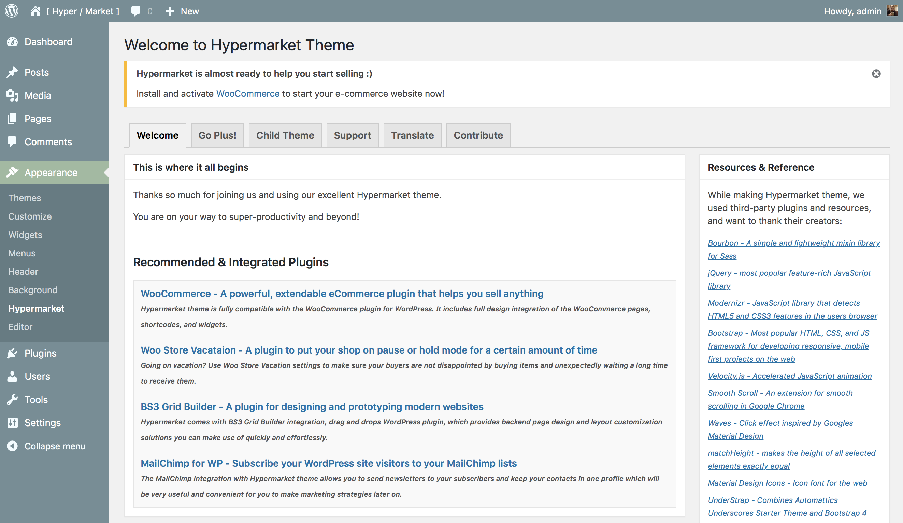

# Installing WooCommerce

[Hypermarket](https://wordpress.org/themes/hypermarket/) theme is fully compatible with WooCommerce plugin, and it comes with a full and unique design integration as well as built-in WooCommerce shortcodes support.
To get started and creating an online shop, you need to install free [WooCommerce plugin](https://wordpress.org/plugins/woocommerce/).

* After activating Hypermarket theme, you’ll see a notice about installing WooCommerce plugin, to proceed click WooCommerce hyperlink. 
*You will be redirected to plugin installation page*
