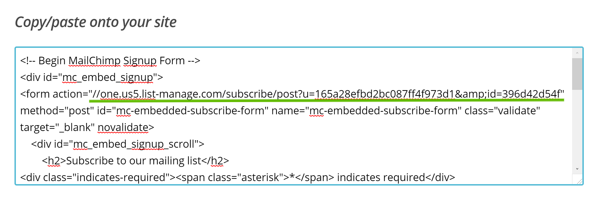
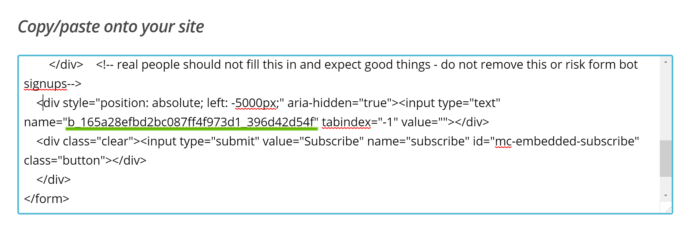

# MailChimp newsletter subscription widget

This option lets you you to embed a MailChimp list signup form on any widget region using MailChimp newsletter subscription widget.

!> This feature is available only to **Hypermarket Plus** users! [Upgrade now](https://www.mypreview.one).

?> Note that this component is built to keep stuff simple. If you need more advanced features such as creating complex newsletter subscription forms or if you need a form builder, feel free to visit [WordPress plugin repository](https://wordpress.org/plugins/search/mailchimp) website and find out more about existing MailChimp newsletter plugins.

To get the form code to add to your site, follow these steps:

* Login to your MailChimp account.
* Navigate to the **Lists** page.
* Click the drop-down menu next to the list you want to work with, and choose **Signup forms**.
* Select **Embedded** forms.
* Choose the **Naked** form type and customize the form options.
* Highlight all the code in the **Copy/paste onto your site** field.
* Optionally, copy the hidden **Honeypot** field value to your clipboard.
* Paste the antispam key into your **Honeypot** field on your widget settings.
* Copy the form **action** URL to your clipboard.
* Paste the embed form action URL into your **Embedded URL** field on your widget settings.

## Spam protection

MailChimp newsletter form component comes with built in **Honeypot** trap which is used to create a form with an extra field that is hidden to human visitors but readable by robots.

In most cases, the robot fills out the invisible field and tries to submit the form which will be prevented to send false info by newsletter form.

?> Although it's a very simple concept, it helps you to reduce spammy submissions.
