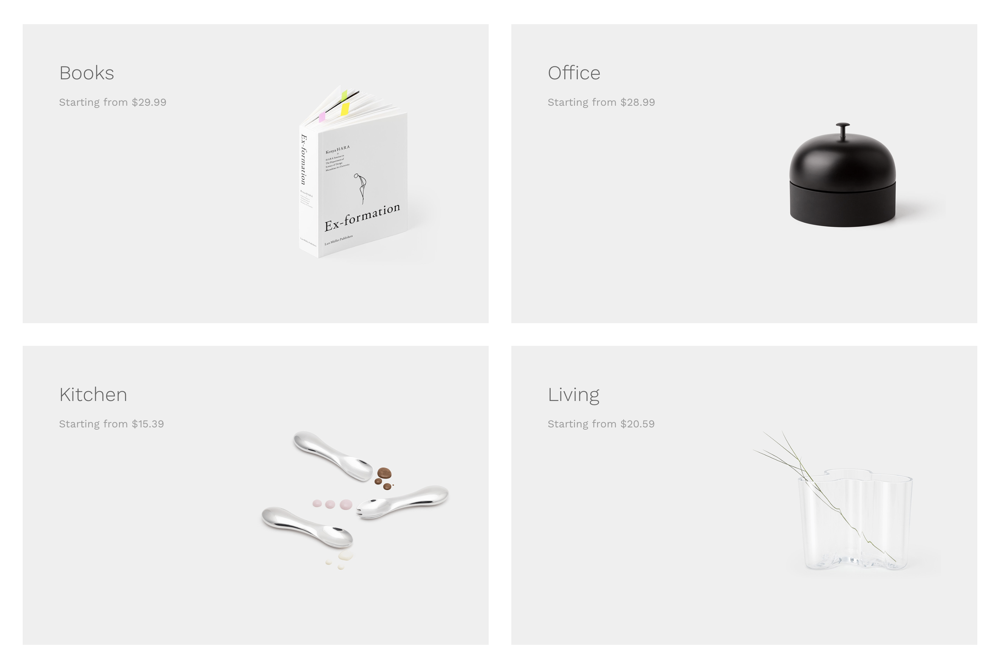
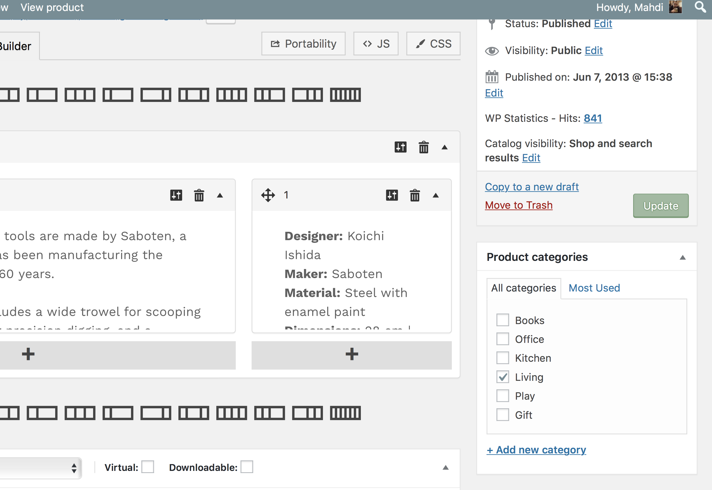

# Managing product categories

Product categories are the main way to group products with similar features. You can also add sub categories if needed.

## Add or edit product categories

Similar to **categories** on your posts in WordPress, you can **add, delete, and edit** your product categories here.

* Add a **Name**.
* Optionally, add a **Slug**; this is the URL-friendly version of the name. 
*You can leave slug name field **empty**, and it will be generated automatically from the color name.*
* Choose a **Parent** if this is a subcategory.
* Optionally, give a Description. 
*Hypermarket theme will display this below the category title.*
* Choose the **Display type**. Here, you decide what is shown on the category’s landing page.  
*Standard will take your theme’s default.* 
*Subcategories will display only the subcategories.* 
*Products will only display products.* 
*Both will display subcategories and products below that.*
* Optionally, **Upload or Add Image**. 
*Hypermarket theme by default shows product category images on the homepage template.*

?> Categories can also be **reordered** by **dragging and dropping** – this order will be used by default on the front end whenever the categories are listed.

When you add a new product through **Products** » **Add Product**, you’ll be able to select this new product category from the list.

Alternatively, you can go to **Products** » **Add Product** directly, and select **Add New Product Category** there.

