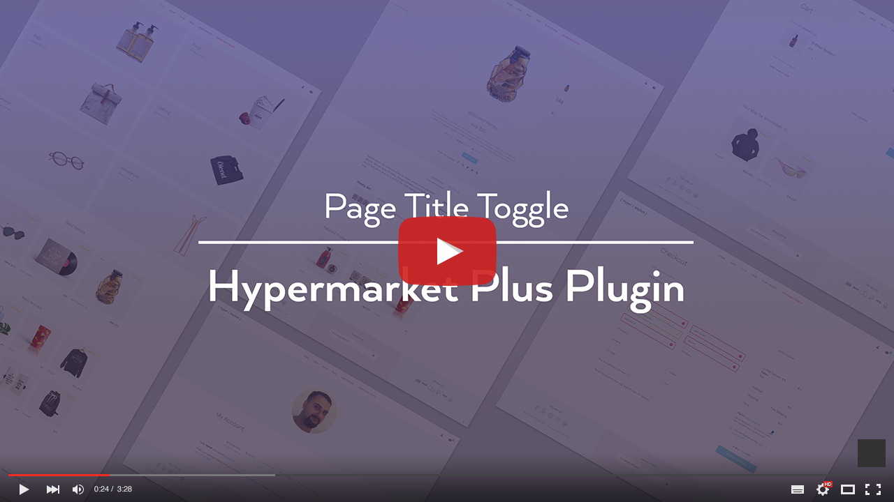

# Page title toggle

This option lets you easily remove the page title from specific single pages, shop or homepage template.

!> This feature is available only to **Hypermarket Plus** users! [Upgrade now](https://www.mypreview.one).

* Click the **Pages** tab.
* Edit the page that you want to hide the title.
* On the edit page, locate the **Title Toggle** meta box in the top right-hand corner of the page. 
* Check **Hide Title** checkbox and update your page.

After the page has been updated, check your page to see if the title has been successfully removed.
