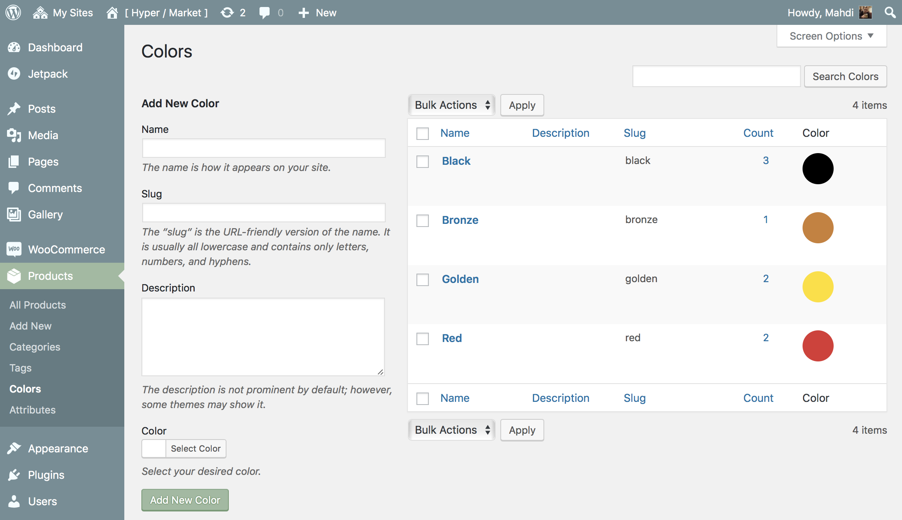

# Product color filters

Color attributes lets you to place the color filter widget on your shop and allow visitors to browse your products by using color filters.

!> This feature is available only to **Hypermarket Plus** users! [Upgrade now](https://www.mypreview.one).

## Add or edit product colors

Color filters are managed from the **Products** » **Colors** screen.

Similar to categories on your products in WooCommerce, you can **add, delete, and edit** your product color filters here.

* Add a **Name**.
* Optionally, add a **Slug**; this is the URL-friendly version of the name.
*You can leave slug name field **empty**, and it will be generated automatically from the color name.*
* Optionally, choose a **Parent** dependence.*
* Optionally, give a **Description**.
* Click the **Select Color** swatch to bring up the color picker dialog box.
* Select your desired color using the color palette or just insert **HEX** color code directly to the color code field.
