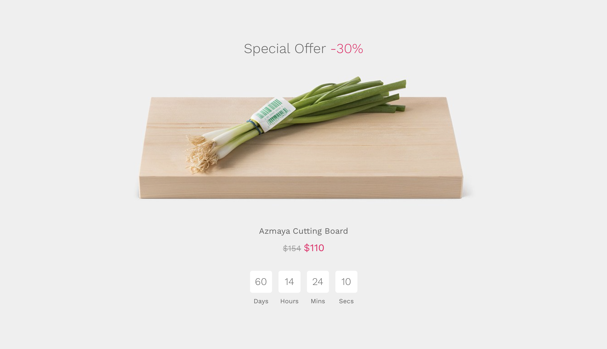

# Product countdown

This option lets you to promote your sale campaigns in WooCommerce. Show a countdown box with the product on sale.

!> This feature is available only to **Hypermarket Plus** users! [Upgrade now](https://www.mypreview.one).

Product countdown section can be adjusted with a few clicks via the WordPress **customizer**. Log into your website and then:

* Navigate to **Products**.
* **Edit** the product that you want to put on sale.
* Scroll down to the **Product Data** meta box where the majority of important data is added for your products.
* Locate the **Sale** price field. 
*Item’s discounted price that can then be scheduled for certain date ranges.*
* Enter the **discounted price** amount in it.
* **Update** the product to save the changes.
* On the frontend, in the Admin bar, click **Site Name** » **Customize**.
* On the backend, click **Appearance** » **Customize**.
* Navigate to **Product Countdown** section.
* Locate the **On Sale Product** option.
* Select the product for which you want to activate the countdown.
* Upload an **image**.
* Set the **ending date** of the sale.
* **Save & Publish**.

?> Note that you can keep the product on sale for as long as you want.
