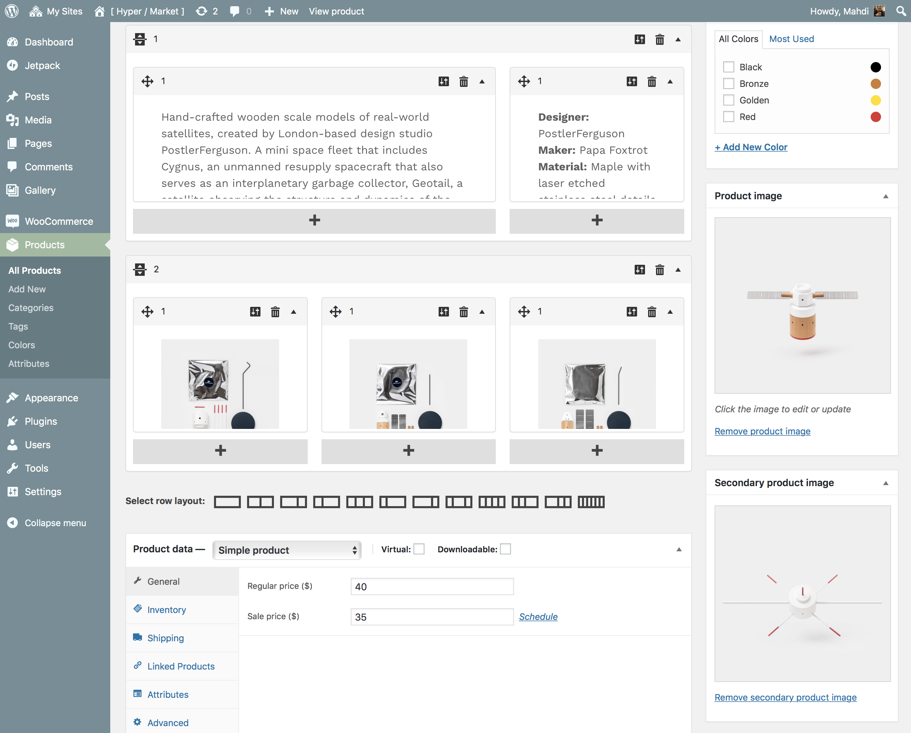

# Product image flipper

Adds a secondary product thumbnail on archives that is revealed when you hover over the main product image. Perfect for displaying front/back shots of clothing and other products.

!> This feature is available only to **Hypermarket Plus** users! [Upgrade now](https://www.mypreview.one).

* Click the **Products** tab.
* Edit the **product** that you want to add a secondary product thumbnail.
* On the edit product page, scroll down until you locate the **Secondary product image** meta box in the bottom right-hand corner of the page.
* Click on the **Set product image**.
* Upload or find an image in your media library and click **select** button to use it.

After the product has been updated, check your product on shop archive pages to see if the secondary product thumbnail has been successfully revealed.
