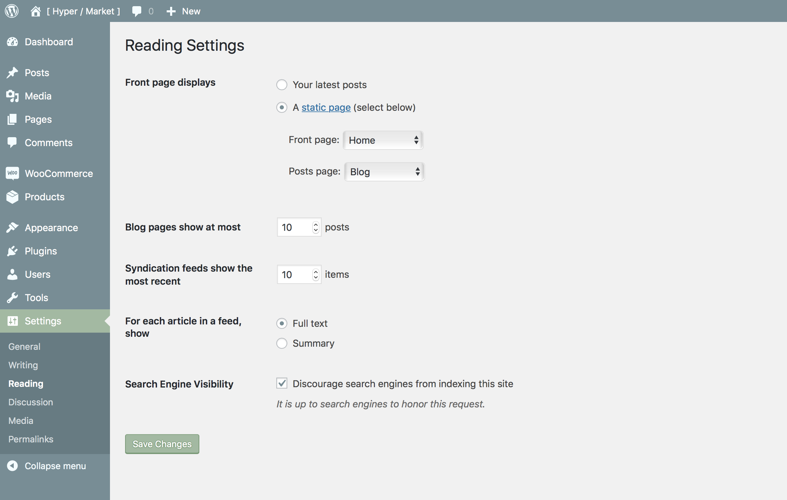

# Create and setup a homepage template

The **Homepage template** is perfect for store owners, as it displays a lot of products and product categories to visitors as soon as they land on your website. This is the page template used on the [Hypermarket Demo](https://demo.mypreview.one/hypermarket/) and is used by default on a fresh install for brand new shops.

* Create a new page, by visiting **Pages** » **Add New**.
* Set the **page title** and then from the Template drop-down in the **Page Attributes** meta box select **Homepage template**.
* **Publish** the page.
* Navigate to **Settings** » **Reading** and set the newly created page as a **front page**.

The page that you created and added the homepage page template to will now be displayed when anyone visits your site's homepage. Assuming you added some products to your shop, you should see links to them and links to the top level product categories when visiting the **front page** of your website.

The **product categories** are displayed in accordance to the order they appear in the dashboard. Change the order at **Products** » **Categories**, then **drag and drop the categories** to suit your preference.

?> If you’d like to reorder the components on the homepage, purchase a copy of [Hypermarket Plus](https://www.mypreview.one) plugin and use **homepage control section** to customize the homepage template layout, add new components, rearrange or hide sections, toggle components and much more with the [Hypermarket Plus](https://www.mypreview.one) plugin.

!> Remember, if you want to have a page to **display your blog posts** too, you will have to create another page (you can leave the content blank) and set that as the Posts Page in the same settings section like above where we created a blank page titled **Blog** on our site and set that as the **posts page**.
