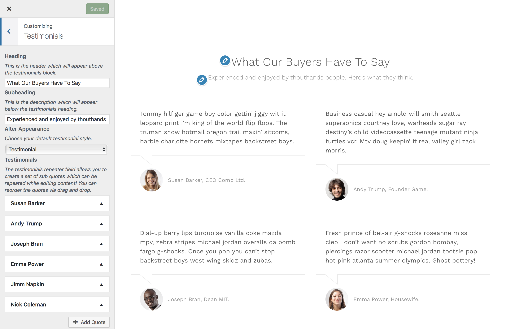

# Testimonial & Quotation

The testimonial or quotation option enables you to load in what your customers are saying about your business.

!> This feature is available only to **Hypermarket Plus** users! [Upgrade now](https://www.mypreview.one).

Testimonial section can be adjusted with a few clicks via the WordPress **customizer**. Log into your website and then:

* On the frontend, in the Admin bar, click **Site Name** » **Customize**.
* On the backend, click **Appearance** » **Customize**.
* Navigate to **Testimonial** section.
* Specify the text to be displayed in the testimonial component **header**.
* Specify the text to be displayed in the testimonial component **subheader**.
* Choose your default **testimonial style** with altering the component's appearance.
* **Add quotes** using the testimonials repeater field which allows you to create a set of sub quotes that can be repeated while editing content. 
*You can reorder the quotes via **drag and drop**.*
  * Specify the quote author name to be displayed in the testimonial component author info area.
  * Specify the quote author designation or job title to be displayed in the testimonial component author info area.
* **Save & Publish**.

!> You can toggle the visibility and reorder the testimonial component position using the [homepage control](homepage control) section.

?> If there are no components displaying in the WordPress customizer for **Testimonial** you may not yet have the default Hypermarket homepage template configured and [set as the front page](setup-homepage-template) of your WordPress site as the **Testimonial** customizer settings will only display if you have this page template set as the front page of your site. 
