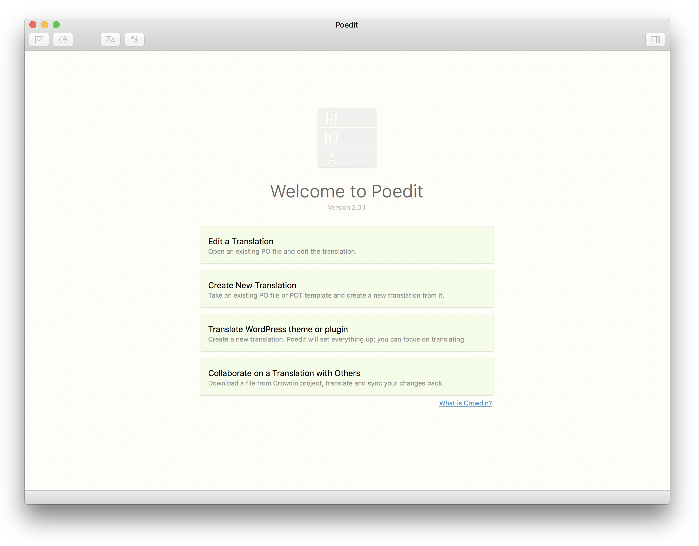
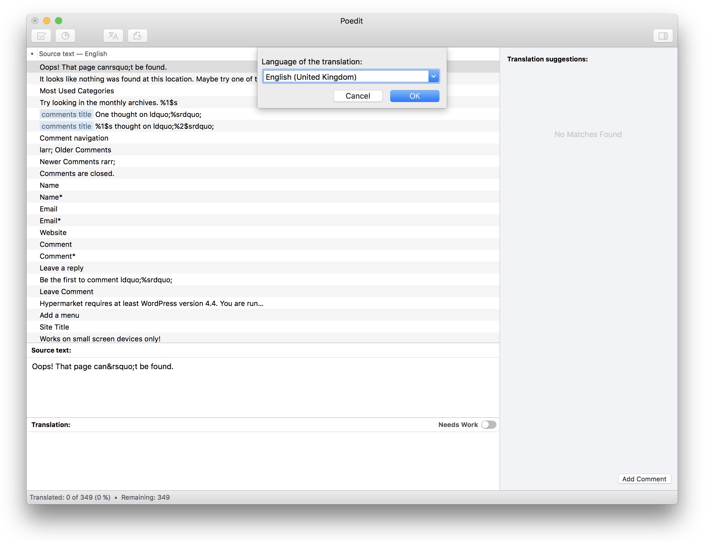

# Translating with Poedit

If you don’t have the [Poedit](https://poedit.net) software installed on your local computer, go ahead and download Poedit now. When the download completes, go through the installation wizard to install it.

After you have installed Poedit, select **Create new translation** option in Poedit welcome screen and browse yours computer for a local copy of the **.pot file** for Hypermarket theme. You should be able to find it in the folder named **languages** within the Hypermarket theme folder.

?> If you did not have a local copy of Hypermarket, You can always download it from [wordpress.org](https://wordpress.org/themes/hypermarket/) theme repository.

You will be prompted with the option **Language of the translation**. Start typing the language and Poedit will fill it in for you. After you have entered the language, open a set of parentheses and enter the name of the country.

The resulting .po file will be named according to abbreviations for the language and associated country. In our case, we are using the English United Kingdom, so our file will be **en_GB.po**.

?> Poedit creates MO and PO extensions automatically, but if you’re interested here’s a lengthy [list of country and language codes](http://www.fincher.org/Utilities/CountryLanguageList.shtml).

Go through every line of human-readable string in Hypermarket theme and translate it to the selected language. As a reminder, the .pot file has already compiled everything you need to translate. That’s how those lines of text got there.

You need to select each line, one by one and enter the translation in the box on the bottom left corner of the Poedit interface.

When you are about to save your new translation file from Poedit, the software automatically generates a new **.mo file** and saves it in the **same directory** on your hard drive.

After saving the files on your hard disk, use any FTP client application to upload both files to the **languages** folder in Hypermarket theme directory. Now all you have to do is notify WordPress to use your new translation files.

WordPress will automatically detect and use the right language files if they already exist.

## PO and MO translation files

WordPress uses **PO and MO** files to manage translations. In fact, WordPress only needs MO files to handle translations.

PO files are human-readable; Those files contains a list of strings ready to be translated or with a translation already included.

MO files just compiled exports from the PO files and used by WordPress to get the conversion of each string to translate the theme. If you try to open a MO file with a regular text editor, you won’t understand anything of its content.
