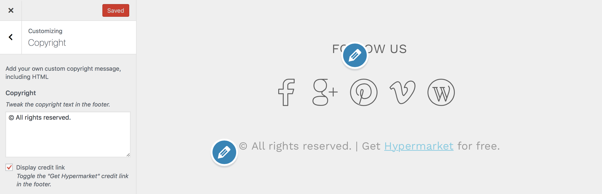

# Update or remove footer copyright

Copyright section gives users the option to customize the footer text as well as disable the Hypermarket credit links.

!> This feature is available only to **Hypermarket Plus** users! [Upgrade now](https://www.mypreview.one).

Copyright section can be adjusted with a few clicks via the WordPress **customizer**. Log into your website and then:

* On the frontend, in the Admin bar, click **Site Name** » **Customize**.
* On the backend, click **Appearance** » **Customize**.
* Navigate to **Copyright** section.
* Add your own custom copyright message, including HTML. 
*There is another option which allows you to remove Hypermarket credit link; you can optionally enable that too*
* **Save & Publish**.
