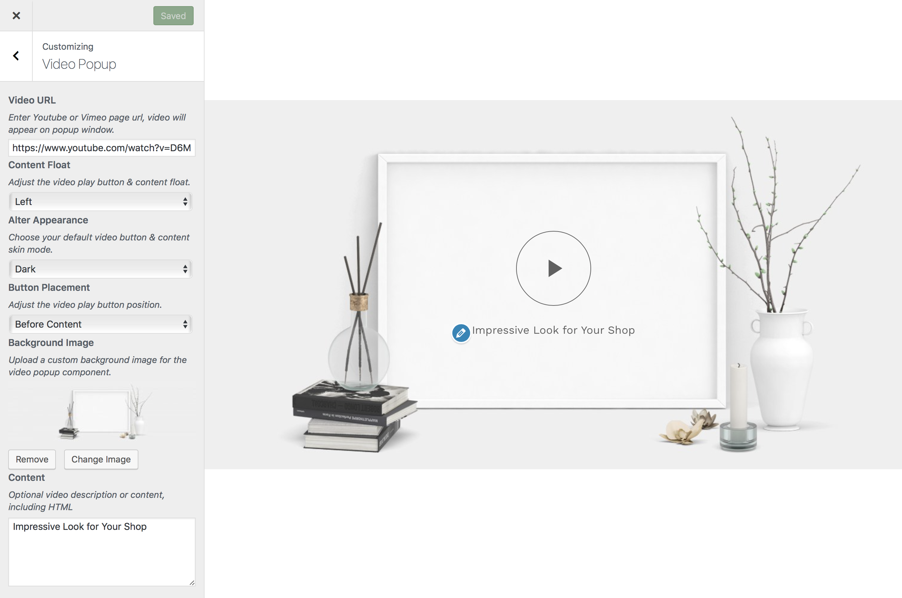

# Video popup

This option lets you to embed **YouTube** or **Vimeo** videos on a call to action box using a popup lightbox overlay display.

!> This feature is available only to **Hypermarket Plus** users! [Upgrade now](https://www.mypreview.one).

Video popup section can be adjusted with a few clicks via the WordPress **customizer**. Log into your website and then:

* On the frontend, in the Admin bar, click **Site Name** » **Customize**.
* On the backend, click **Appearance** » **Customize**.
* Navigate to **Video Popup** section.
* Enter **Youtube** or **Vimeo** page url, video will appear on popup window.
* Adjust the video play button & content **float**.
* Choose a default video button & content **skin mode**.
* Adjust the video play button **position**.
* Upload a custom **background image** for the video popup component.
* Optionally, give a **video description** or content, including HTML.
* **Save & Publish**.

!> You can toggle the visibility and reorder the video popup component position using the [homepage control](homepage control) section.

?> If there are no components displaying in the WordPress customizer for **Video Popup** you may not yet have the default Hypermarket homepage template configured and [set as the front page](setup-homepage-template) of your WordPress site as the **Video Popup** customizer settings will only display if you have this page template set as the front page of your site. 
